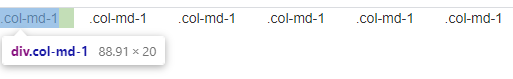
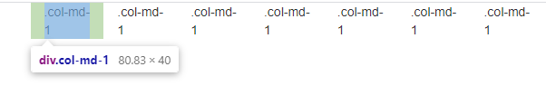
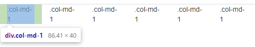
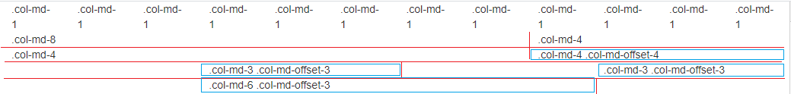
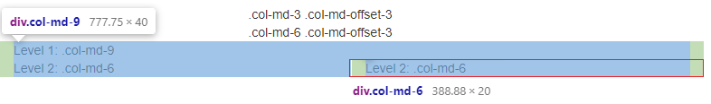

그리드 시스템
=====
* 부트스트랩은 반응형 웹디자인(responsive web design)을 기반으로 쉽고 강력한 레이아웃 기능 제공
* 부트스트랩은 기기별로 각각 클래스를 나누어서 설정 가능
* [전체 예제 소스](https://github.com/nara1030/bootstrap-practice/blob/master/src/ch02_03.html)
- - -
## 목차
1. [그리드 옵션](#그리드-옵션)
2. [예제](#예제)
	1. [오프셋 설정](#오프셋-설정)
	2. [칼럼 중첩](#칼럼-중첩)
	3. [푸시와 풀](#푸시와-풀)

## 그리드 옵션
| | Phone(~768) | Tablets(768~992) | Desktop(992~1200) | Large Device(1200~) |
| -- | -- | -- | -- | -- |
| class prefix | .col-xs- | .col-sm- | .col-md- | .col-lg- |
| 컨테이너 최대 너비 | auto | 750px | 970px | 1170px |
| 열 최대 너비 | auto | 60px | 78px | 95px |

##### [목차로 이동](#목차)

## 예제
```html
<div class="row">
	<div class="col-md-1">.col-md-1</div>
	<div class="col-md-1">.col-md-1</div>
	<div class="col-md-1">.col-md-1</div>
	<div class="col-md-1">.col-md-1</div>
	<div class="col-md-1">.col-md-1</div>
	<div class="col-md-1">.col-md-1</div>
	<div class="col-md-1">.col-md-1</div>
	<div class="col-md-1">.col-md-1</div>
	<div class="col-md-1">.col-md-1</div>
	<div class="col-md-1">.col-md-1</div>
	<div class="col-md-1">.col-md-1</div>
	<div class="col-md-1">.col-md-1</div>
</div>

<div class="row">
	<div class="col-md-8">.col-md-8</div>
	<div class="col-md-4">.col-md-4</div>
</div>
```

1. 행은 `row`, 열은 `col` 클래스로 표현하고 12열 격자 시스템을 사용
2. 사이즈는 `col-md-1`에서 `col-md-12`까지 지정 가능하고 col의 합은 12 내에서 지정
3. 화면 크기에 맞게 반응형 그리드 시스템을 지원하기 때문에 같은 페이지를 각각 디바이스에 맞게 최적화[1] 가능
4. 실행 결과[2]  
	</br>

- - -
1. 미디어 쿼리
2. div 태그(`class="row"`)를 컨테이너로 감싸면 실행 결과는 아래와 같이 달라짐
	1. `<div class="container"></div>`  
		</br>
	2. `<div class="container-fluid"></div>`  
		</br>

##### [목차로 이동](#목차)

### 오프셋 설정
```html
<div class="row">
	<div class="col-md-4">.col-md-4</div>
	<div class="col-md-4 col-md-offset-4">.col-md-4 .col-md-offset-4</div>
</div>
<div class="row">
	<div class="col-md-3 col-md-offset-3">.col-md-3 .col-md-offset-3</div>
	<div class="col-md-3 col-md-offset-3">.col-md-3 .col-md-offset-3</div>
</div>
<div class="row">
	<div class="col-md-6 col-md-offset-3">.col-md-6 .col-md-offset-3</div>
</div>
```

1. 오프셋 설정을 통해 칼럼을 건너뛰어서 배치 가능
2. `.col-md-offset-4`는 왼쪽에서 `md-4`만큼 띄어서 배치
3. 실행 결과  
	</br>

##### [목차로 이동](#목차)

### 칼럼 중첩
```html
<div class="row">
	<div class="col-md-9">
		Level 1: .col-md-9
		<div class="row">
			<div class="col-md-6">
				Level 2: .col-md-6
			</div>
			<div class="col-md-6">
				Level 2: .col-md-6
			</div>
		</div>
	</div>
</div>
```

1. `col-md-9` 안에 `col-md-6`가 두 개 존재하는데, 9 영역은 자식들에게 모든 영역을 할당[1]
2. 자식 칼럼은 부모의 영역을 다시 12 등분하여 할당  
(중첩된 자식 칼럼의 합은 12가 되어야 함)
3. 실행 결과  
	</br>

- - -
1. .
2. .

##### [목차로 이동](#목차)

### 푸시와 풀
```html
<div class="row">
	<div class="col-md-9 col-md-push-3">.col-md-9 .col-md-push-3</div>
	<div class="col-md-3 col-md-pull-9">.col-md-3 .col-md-pull-9</div>
</div>
```

1. push는 왼쪽으로부터 떨어지는 지점을 말함  
(`push-3`이면 왼쪽에서 3 영역만큼 떨어진 곳에 위치)
2. pull은 오른쪽에서 떨어진 지점을 말함  
(`pull-9`이면 오른쪽에서 9 영역만큼 떨어진 왼쪽에 위치)

##### [목차로 이동](#목차)