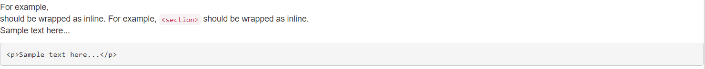
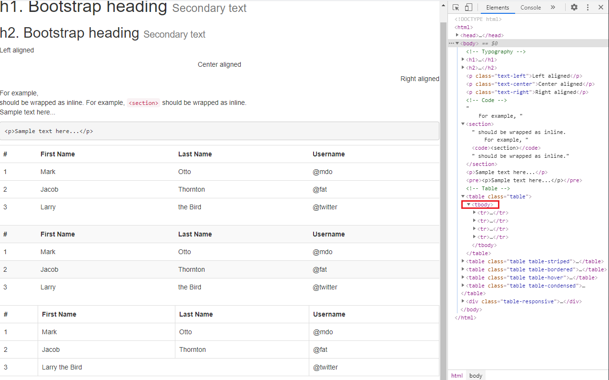

타이포그래피, 코드, 테이블
=====
* [전체 예제 소스](https://github.com/nara1030/bootstrap-practice/blob/master/src/ch02_04.html)
- - -
## 목차
1. [타이포그래피](#타이포그래피)
2. [코드](#코드)
3. [테이블](#테이블)

## 타이포그래피
```html
<h1>h1. Bootstrap heading <small>Secondary text</small></h1>
<h2>h2. Bootstrap heading <small>Secondary text</small></h2>

<p class="text-left">Left aligned</p>
<p class="text-center">Center aligned</p>
<p class="text-right">Right aligned</p>
```

1. 글의 제목은 `<h1>`에서 `<h6>`까지 표현이 가능하고 제목에는 `<small>` 요소 삽입 가능
2. `<body>` 본문 기본 폰트는 14px이고 line-height는 1.428임[1]
3. `<body>` 내 폰트 속성 변경 가능
	1. `<p> .. </p>`: 행 높이 절반의 마진값[2]
	2. `<small> .. </small>`: 작은 텍스트
	3. `<strong> .. </strong>`: 굵은 폰트
	4. `<em> .. </em>`: 이탤릭체
4. `<p>` 태그 내 문자 정렬은 `.text-left`, `.text-center`, `.text-right` 클래스 사용
5. 그 밖의 태그
	```txt
	<abbr>
	<address>
	<blockquote>
	<ul>
	<ol>
	<dl>
	```

- - -
1. .
2. .

##### [목차로 이동](#목차)

## 코드
```html
For example, <section> should be wrapped as inline.
For example, <code>&lt;section&gt;</code> should be wrapped as inline.

<p>Sample text here...</p>
<pre>&lt;p&gt;Sample text here...&lt;/p&gt;</pre>
```

1. 코드에 해당하는 부분은 `<code>`로 감싸주면 기본 지정된 컬러값 빨간색 스타일이 지정
2. `<code>`의 기본스타일은 컬러값 빨간색, 글꼴 90%, 배경 흰색(`#f9f2f4`), border-radius는 4px
3. HTML Character Entity[1]
4. `<pre>`는 여러 줄의 코드를 표기할 때 유용[2]
5. `pre-scrollable` 클래스는 높이가 340px로 한정되고 오버 플로우되면 스크롤 생성[3]
6. 실행 결과  
	</br>

- - -
1. https://dev.w3.org/html5/html-author/charref
2. `<pre>`
	* Preformatted Text의 약자로, `<pre>` 태그로 감싼 문장은 입력한 형태 그대로 브라우저에 출력
	* `Enter`, `Tab`, `Space`도 `<pre>` 안에서는 그대로 유지되기에 여러 줄의 코드를 표기할 때 유용  
	(`<pre>` 태그 밖에서는 모두 한 칸으로 인식)
3. .

##### [목차로 이동](#목차)

## 테이블
```html
<table class="table">
	<th>#</th>
	<th>First Name</th>
	<th>Last Name</th>
	<th>Username</th>
	<tr>
		<td>1</td>
		<td>Mark</td>
		<td>Otto</td>
		<td>@mdo</td>
	</tr>
	<tr>
		<td>2</td>
		<td>Jacob</td>
		<td>Thornton</td>
		<td>@fat</td>
	</tr>
	<tr>
		<td>3</td>
		<td>Larry</td>
		<td>the Bird</td>
		<td>@twitter</td>
	</tr>
</table>
```

1. 테이블은 화면구성에서 가장 많이 사용되고 있는 만큼 다양한 옵션을 제공  
	```html
	<table class="table">
	</table>
	
	<table class="table table-striped">
	</table>
	
	<table class="table table-bordered">
	</table>
	
	<table class="table table-hover">
	</table>

	<table class="table table-condensed">
	</table>
	```
2. 테이블 내의 `tr`이나 `td`의 클래스를 지정해 상태를 색상으로 표현 가능  
	```html
	<tr class="active">
	</tr>
	
	<tr class="success">
	</tr>
	
	<tr class="warning">
	</tr>
	
	<tr class="danger">
	</tr>
	```
3. 기타
	1. 열 병합: `colspan`  
	행 병합: `rowspan`
	2. 몇몇 브라우저는 `<tbody>` 태그로 `<tr>` 태그를 감쌈[1]  
	(`<table>`에서 `<tr>`로 직접 접근 불가)  
	</br>

- - -
1. tbody
	* [Bootstrap 4 - Tables](https://getbootstrap.com/docs/4.0/content/tables/)
	* [HTML `<tbody>` Tag](https://www.w3schools.com/tags/tag_tbody.asp)
2. .

##### [목차로 이동](#목차)